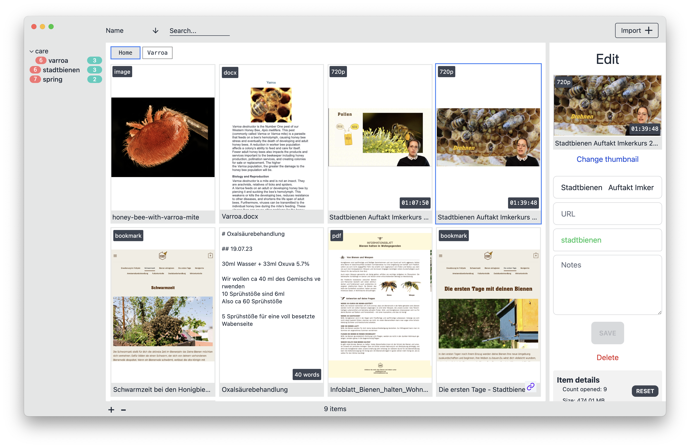

# TagNest
*This application is part of my final project for the MSc. Computer Science, Keele University.*

> [!WARNING]  
> Currently the application was only tested on macOS 14.5 with Apple Silicon

TagNest allows users to organize files and bookmarks using tags. Bookmarks get saved locally by utilizing a Chrome extension, and files get added to TagNest by importing them.
You can import any file to TagNest. It allows their organization and includes additional functionality for some types of files inside the application. (e.g., videos, text files, PDF files and audio files can be opened inside TagNest)
For faster retrieval of previously seen information, TagNest allows highlights to be added to both bookmarks and imported videos.



## Get started
### Release
The current release can be found under [Releases](https://github.com/dadonc/eTags/releases)

### Chrome extension
The Google Chrome extension can be found in the **/chrome_extension** folder. Add the Google Chrome extension by following [this](https://superuser.com/a/247654) instructions.

### Development
To get started, clone or download this repository and run 
```
npm i
npm run start
```

### Packaging
Package this application using
```
npm i
npm run package
```

## Code organization
* **/chrome_extenision** The Chrome extension
* **/prisma** Schema and migrations of the used [Prisma](https://www.prisma.io/) ORM
* **/src** Electron specific code
* **/svelte** The frontend written in Svelte

